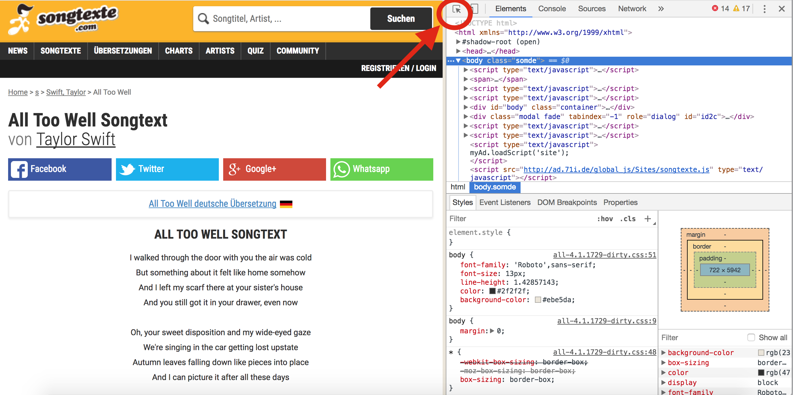
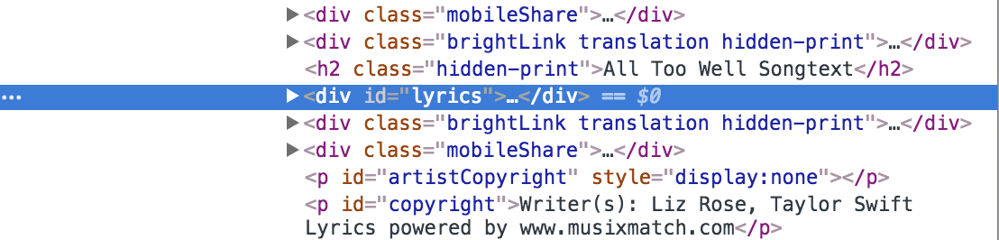

```{r, loading packages, results = "hide", message = FALSE}
library(rvest) # For web mining
library(stringr) # For cleaning Strings
library(dplyr) # For manipulating data frames
library(tm) # For text operations necessary to create a word cloud
library(wordcloud) # For creating a word cloud
library(ggplot2) # For producing visualizations
```

# Introduction and Motivation  

We've developed a large toolbox for working with and analyzing strings, but so far we've been restricted to looking at strings that we either type out by hand or are easily imported as rows and columns in a csv or other spreadsheet format. Of course, there's lots of interesting data that exists outside of already established spreadsheets -- think about the power of being able to pull text data directly from online sources. This allows our power as a data scientist to extend past doing research on data that was, in a sense, prepared specifically *for* data analysis by whoever originally created the spreadsheet. It can be hard to find data in a spreadsheet that will allow you to perform an analysis that is truly new. 

Web mining is actually similar in many ways to gold mining. First, there's a huge digital landscape to scour. It's easy to get lost in the [over one billion](https://www.theatlantic.com/technology/archive/2015/09/how-many-websites-are-there/408151/) accessible websites. Even once you've narrowed your search down to a location on the web that you believe has valuable information, trying to take all of it is akin to bringing home a whole plot of land. You'll quickly become bogged down with data that contains mostly dirt and is hard to use for anything practical. Luckily, web mining also shares the positives of gold mining -- with the proper techniques and some practice, you'll be able to strike it rich with a nugget of gold -- a brand new dataset.

I plan to show you some of these techniques to allow you to take text data from online sources. I'll be specifically working with song lyrics, but you can easily extend the principles to be able to take data from news articles, social media posts, and even other blog posts like this! 

# Reading Web Data into R

### Background About HTML  

At a basic level, all websites are written in HTML, or Hypertext Markup Language. Every time you load a website, your browser interprets data written in HTML and decides what to display and how to display it. HTML bears some similarities to Markdown. For example, \<b>this text would appear bold in HTML.\</b> The characters in angled brackets describe **how** to display text and much like the two asterisks I used to bold the word "how," are not displayed by default in the final rendered version. I escaped the characters to make this document becuase R Markdown understands HTML formatting and by default would actually bold the example text.  

This is important to reading websites because these tags will tell us where to look for the specific information we want. For example, pesky lists of advertiser website hyperlinks are unlikely to be denoted with a \<p> (paragraph) tag. But before we get into all those specifics, let's take a step back and actually load a webpage into R.  

### Using the Package Rvest  

Our main tool for brining web data into a usable format will Hadley Wickham's package [Rvest](https://cran.r-project.org/web/packages/rvest/rvest.pdf). The first and most basic function to use is `read_html()` which takes in a url as a string and automatically reads the html contents of the corresponding website into a list. 

Let's try an example! I'll read in [this website](http://www.songtexte.com/songtext/taylor-swift/all-too-well-53a71b61.html) which contains the lyrics to Taylor Swift's song "All Too Well."   

According to [the Berkeley Department of Statistics ](https://statistics.berkeley.edu/computing/r-reading-webpages), the best practice is to always download a local copy of the website you'll be analyzing. This prevents you from putting unnecessary strain on the website's server. There are also practical reasons to download your own copy -- it takes a while to read and download a website from the internet the first time, but accessing and reading a local copy is very fast. Also, downloading your own copy ensures that you can continue your analysis regardless of the future status of the website. If you lose internet access or the site owners take the content down, you'll still be able to read the files on your local device.  

I'll use a fairly standard file structure with a data folder. Use the base R `download.file` function and update the file path according to the structure you prefer for the project you're working on. This project has two subfolders within data, one called "first_example," (without the comma) which we will use now, and another called "song_lyrics," (also without the comma) which we will use later.

```{r, read in all too well data}
example_song_name <- "All_Too_Well"
example_song_url <- "http://www.songtexte.com/songtext/taylor-swift/all-too-well-53a71b61.html"

# This is commented out because you only have to (and should only) download once

#download.file(url = example_song_url,
              #destfile = paste0("../../static/data/web_scrape_guide/first_example/",
               #                 example_song_name))

all_too_well <- read_html("../../static/data/web_scrape_guide/first_example/All_Too_Well")

str(all_too_well)
```

Inspecting the structure of the output, we see that we have a list of two items: something of class `xml_document` and something of class `xml_node`. Unfortunately, we can't use this list directly -- calling the `all_too_well` object outputs what looks like nonsense:

```{r, displaying all too well xml document}
all_too_well
```

The next step is to use rvest to extract only the components of the webpage that we're actually interested in using the function `html_nodes()`. This is probably the most challenging part of the process, as it requires going to the website itself and identifying the HTML tags that describe the part we're interested in.  

If you're using Google Chrome on a Mac, go to the website and push option command i to automatically open up information about the HTML structure of whatever website you're on. Chrome on a PC isn't much different -- just use the control key instead of the command key. If you're on Safari, follow the steps [here](http://www.socialmeteor.com/2013/03/04/how-to-view-html-source-in-safari-web-browser/). If you have a different browser, follow the steps on [this site](https://www.computerhope.com/issues/ch000746.htm). 

With that said, I do highly recommend using Google Chrome. Chrome will make the following steps much easier. If you're following along and using Google Chrome, you should see something like this:

<br>  



<br>

Take special notice of the part that I added a red circle to in upper center part of the picture. That's a selector tool which will allow you to find your desired HTML tags without first becoming an HTML coding wizard. Click on that tool and then interactively move your cursor around the left part of the screen (without clicking) until the text you want is highlighted. Click once and notice the change on the right hand side. If you do this step correctly and highlight only the lyrics, you should see this line highlighted on the right side of the page: 

<br>



<br>

The text is partitioned off in a `<div>` tag, which means it's divided from other parts. Looking at the lines above and below the highlighted one though, you'll see it's not the only `<div>` tag. Luckily, the people who set up the page included an ID for this particular tag, which you can see in `<div id="lyrics">`.  

We can use the `html_nodes()` function to capture only the part of the web data contained within this particular tag. This function requires two arguments: the output of a call to `read_html()` and the id of our desired tag, set off with quotes and a hash symbol. The hash does **not** appear in the id listed on the site, so be careful not to forget it.  

```{r, all too well node}
all_too_well_node <- html_nodes(all_too_well, "#lyrics")
all_too_well_node
```

This looks much better -- already we can see some of the lyrics text, but we still have that pesky {xml_nodeset} hanging around. We can immediately use the function `html_text()` to extract the text from this node!  

```{r, getting the all too well text}
all_too_well_text <- html_text(all_too_well_node)

# This outputs a list with one long element. This next line uses stringr to
# extract only the first 300 characters.

(substr(all_too_well_text[[1]], 1, 300))
```

We've done it! The text is clearly there, and now the only problems are that we have "\\n" hanging around at any line break and that the contents are in a one element vector instead of a vector of separate words. We've done all we can with rvest, and now we'll use stringr to clean the output and do some analysis!  

#### A Note About Finding Tags  

Hadley Wickham recommends using the Google Chrome extension [Selector Gadget](https://cran.r-project.org/web/packages/rvest/vignettes/selectorgadget.html) to find your desired HTML tags. I downloaded version 1.1 here from [the Chrome extension store](https://chrome.google.com/webstore/detail/selectorgadget/mhjhnkcfbdhnjickkkdbjoemdmbfginb) and can confirm that it works and didn't have any adverse effects. With that said, I haven't used it for any web mining and won't be going into the details of how it works. Feel free to experiment with it for your own web mining in the future. 

# Song Lyric Analysis  

### Data Cleaning with Stringr  

As you may recall, stringr is [another package](https://cran.r-project.org/web/packages/stringr/stringr.pdf) written by Hadley Wickham. It's main purpose is to perform cleaning tasks on data stored as a string. We'll be using it to remove the "\\n" characters from song lyrics and replace them with a space.  

```{r, clean the all too well text}
# pattern matches all "\n" and changes to a space

all_too_well_clean <- str_replace_all(all_too_well_text,
                                      pattern = "\n",
                                      replacement = " ")

# taking a look again at the first 300 characters

substr(all_too_well_clean, 1, 300)
```

**Caution:** Make sure to use `str_replace_all()` instead of `str_replace()` because we want to catch every instance of the pattern, not just the first example.  

It seems like our text data is pretty clean! As a matter of preference, I'm going to separate dashed words into two separate words using the same cleaning method as above. I'll also remove any commas and periods from the text.

The next step is then to put the data into a vector, with one word per element instead of all words in one element of a list. First, I'll use the `str_split()` function to split the single list element every time we encounter a space. Then I'll use the base R function `unlist()` to convert the list to a many element vector. 

```{r, more all too well text cleaning}
# Separates dashed words into two words

all_too_well_clean <- str_replace_all(all_too_well_clean,
                                      pattern = "-",
                                      replacement = " ")

# Removes any periods or commas from the data  

all_too_well_clean <- str_replace_all(all_too_well_clean,
                                    pattern = "[\\.,]", # Character set of . ,
                                    replacement = "")

# Splits the words into separate elements

all_too_well_clean <- str_split(all_too_well_clean,
                                pattern = " ")

# We now have a one element list with many elements in the first position
# Use the base R function unlist to get this into a vector

all_too_well_clean <- unlist(all_too_well_clean)

# This is a very long vector, so let's take a look at the head and the length

length(all_too_well_clean)

head(all_too_well_clean, 5)
```

So the song "All Too Well" has 466 words and starts with "I walked through the door." 

#### A Note about Reproducibility  

I can anticipate the important question: "Hey, what was the point of all that? I had to mess around with HTML and write a bunch of code just to find out the first five words of the song? Couldn't I just read the lyrics myself or copy paste them in myself? That would be a lot faster!"  

It might be true that when harvesting a single song, page, or article, it's faster to copy paste in the relevant parts. However, as tempting as it is to exercise your control c control v muscles, this process will become time consuming and prone to error over longer projects. It won't take very much more time to import 10 or 100 songs than it did for one with the coding process (and a for loop), but to do the same with copy and pasting would take 10 and 100 times as long. To demonstrate this, let's actually read in the lyrics from my favorite and least favorite song from each of Taylor Swift's [studio albums](https://en.wikipedia.org/wiki/Taylor_Swift_discography#Studio_albums). 

### Scraping and Cleaning More Lyrics for Analysis

First, I'll load the names and urls of the songs that I'm interested in analyzing: 

```{r, describe favorite songs}
# My favorite song from each album: 
favorite_songs <- c("Should've Said No",
                    "Change",
                    "Sparks Fly",
                    "All Too Well",
                    "Clean",
                    "Call It What You Want")

# My least favorite song from each album:
least_favorites <- c("Mary's Song",
                     "The Best Day",
                     "Mine",
                     "I Knew You Were Trouble",
                     "Out of the Woods",
                     "Look What You Made Me Do")

# Change the names of the songs to have underscores instead of spaces
favorite_songs <- str_replace_all(favorite_songs,
                                  pattern = " ",
                                  replacement = "_")
least_favorites <- str_replace_all(least_favorites,
                                   pattern = " ",
                                   replacement = "_")

# Favorite and least favorite together
song_names <- c(favorite_songs, least_favorites)

# Url for the lyrics of each song 
song_urls <- (
  c("http://www.songtexte.com/songtext/taylor-swift/shouldve-said-no-4b4ba34a.html",
    "http://www.songtexte.com/songtext/taylor-swift/change-3ccd59f.html",
    "http://www.songtexte.com/songtext/taylor-swift/sparks-fly-4be8472e.html",
    "http://www.songtexte.com/songtext/taylor-swift/all-too-well-53a71b61.html",
    "http://www.songtexte.com/songtext/taylor-swift/clean-1b4b8100.html",
    "http://www.songtexte.com/songtext/taylor-swift/call-it-what-you-want-g3be734ec.html",
    "http://www.songtexte.com/songtext/taylor-swift/marys-song-oh-my-my-my-1b738dc8.html",
    "http://www.songtexte.com/songtext/taylor-swift/the-best-day-43cd27b7.html",
    "http://www.songtexte.com/songtext/taylor-swift/mine-53ebbb5d.html",
    "http://www.songtexte.com/songtext/taylor-swift/i-knew-you-were-trouble-53a71b59.html",
    "http://www.songtexte.com/songtext/taylor-swift/out-of-the-woods-5b4a330c.html",
    "http://www.songtexte.com/songtext/taylor-swift/look-what-you-made-me-do-g13fabd81.html"))
```

Next, I'll write a for loop generalizes what I did for "All Too Well" above. The output will be a list of 12 vectors where each element contains the lyrics to one of the songs above. 

You'll notice a fair amount of gymnastics in the code below. In order to extract only the words themselves, we'll need to remove characters such as `,.?!()/\` and replace them with the empty string. The problem is that some of those characters are *metacharacters* instead of literals, which means we can't substitute them directly into our functions.  

To get around this, I'll escape them using `\`. The only problem comes from the `\` character itself, which isn't quite as easily removed using `str_replace_all()`. Following the advice of [this stack overflow thread](https://stackoverflow.com/questions/25424382/how-to-replace-single-backslash-in-r), I'll use the base R function gsub for that.  

Finally, I'll convert everything to lowercase.  

**Caution:** Make sure your file structure matches mine (a data folder with two subfolders) otherwise these lines of code will not work. Optionally change both your file structure and the file paths in the code.  

```{r, mine and clean song lyrics from internet}

# Download local copies of the web pages to the data/song_lyrics folder
# Again, this is commented out to avoid spamming their servers. Only download once.

#for (i in 1:length(song_urls)) {
  #download.file(url = song_urls[i],
                #destfile = paste0("../../static/data/web_scrape_guide/song_lyrics/", song_names[i]))
#}


# Initialize an empty vector to be filled with lyrics
swift_song_lyrics <- (rep(NA, length(song_names)))

# Read the data from the web source using pipe notation for brevity
for (i in 1:length(song_names)) {
  swift_song_lyrics[i] <- (paste0("../../static/data/web_scrape_guide/song_lyrics/", song_names[i]) %>% 
                          read_html() %>%
                          html_nodes("#lyrics") %>%
                          html_text() %>%
           # Next we'll replace new lines and dashes with spaces
                          str_replace_all(pattern = "[\n-]", 
                                      replacement = " ") %>%
           # Next we'll replace periods, commas, !, ?, and  parentheses with ""
                          str_replace_all(pattern = "[\\.,!/?()]",
                                      replacement = "") %>%
                          str_split(pattern = " "))
}

# Do some additional preprocessing

for (i in 1:length(swift_song_lyrics)) {
  # First change everything to lowercase
  swift_song_lyrics[[i]] <- tolower(swift_song_lyrics[[i]])
  
  # Next remove any double quotations inside words
  swift_song_lyrics[[i]] <- str_replace_all(swift_song_lyrics[[i]], "\"", "")
  
  # Finally use gsub to remove the \ characters
  swift_song_lyrics[[i]] <- (gsub("\\", "", swift_song_lyrics[[i]], fixed = TRUE))
}

```

Let's take a look at the first 5 words of each song to make sure we have a list of 12 items where each contains lower case separated song words:  

```{r, print a few words about each song}
for (i in 1:length(swift_song_lyrics)) {
  print(swift_song_lyrics[[i]][1:5])
}
```

This looks perfect! Our data is mined and clean, and now we've created a workable dataset which will allow us to do some analysis that might not have been done before.  

### Analysis of Repetition  

Let's see how repetitive each of these songs are. To do this, we'll use the base r function `unique()` which takes in a vector (of any type) and returns a vector which contains the same thing as the original but with any duplicate elements removed. 

Start by computing the total number of words per song and putting it into a dataframe: 

```{r, make a data frame with title and words}
# Initialize a vector of the correct length
total_words_by_song <- rep(0, length(swift_song_lyrics))

# Use a for loop to add the accurate length one song at a time
for (i in 1:length(total_words_by_song)) {
  total_words_by_song[i] <- length(swift_song_lyrics[[i]])
}

# Change song names back to having spaces. This will make the eventual graph nicer

song_names <- str_replace_all(song_names,
                                  pattern = "_",
                                  replacement = " ")


# Make a dataframe with one row per song: 
song_frame <- data.frame("Title" = song_names,
                         "Total_Words" = total_words_by_song)

head(song_frame, 5)
```

Next, compute the total number of unique words per song and add this to the data frame:  

```{r, add unique words column}
# Initialize a vector of the correct length
unique_words_by_song <- rep(0, length(swift_song_lyrics))

# Use a for loop to add the number of unique words per song
for (i in 1:length(unique_words_by_song)) {
  unique_words_by_song[i] <- length(unique(swift_song_lyrics[[i]]))
}

song_frame$Unique_Words <- unique_words_by_song
head(song_frame, 5)
```

Finally, let's find the fraction of words per song that are unique. To help with some later analysis, I'll include a factor that says whether the song is one of my favorites or least favorites and the number of years since 2006, which was when Taylor Swift's first album was released

```{r, add a few new columns}
# Divide the unique words by the total words for the fraction that are unique
frac_unique <- unique_words_by_song/total_words_by_song

# Add the appropriate column
song_frame$Fraction_Unique <- frac_unique

# Add a column to specify my feelings about the song
feelings <- rep(c("favorite", "least favorite"), each = 6)

song_frame$Opinion <- as.factor(feelings)

# Add a column specifying years since 2006
years_since_2006 <- rep(c(0,2,4,6,8,11),2)

song_frame$Years_Since_2006 <- years_since_2006

# Display some rows
slice(song_frame, c(1,2,7,8))
```

Finally, let's use ggplot2 to make a visualization displaying what we've found so far:  

```{r, create a plot}
gg_song_plot <- (ggplot(data = song_frame,
                        aes(x = Years_Since_2006,
                            y = Fraction_Unique,
                            color = Opinion)) + 
                   geom_point(size = 4) +
                   geom_label(aes(label = Title),
                              alpha = .75,
                              nudge_x = .25,
                              nudge_y = .01,
                              size = 2.5) +
        # This next line ensures the labels aren't cut off
                   xlim(c(-1, 13)) +
                   labs(title = "Song Word Uniqueness Over Time",
                         x = "Years Since 2006",
                         y = "Fraction of Lyrics that are Unique") +
        # This is totally optional and just to make the plot look better
                    theme(plot.title = element_text(color = "black",
                                                    size = 14,
                                                    face = "bold.italic"),
                          axis.title.x = element_text(size = 12,
                                                  face = "bold"),
                          axis.title.y = element_text(size = 12,
                                                      face = "bold")))
gg_song_plot
```

As you can see, on average, the songs I selected have gotten more repetitive over time as Taylor Swift transitioned from country music to pop music. You can also see that I tend not to prefer songs that are very repetitive, as all songs with less than one quarter of their words unique were in my least favorite category.  

Let's see if there's any relationship between the length of the song and the amount of uniqueness:  

```{r, plot uniqueness against length}
# This calculates the correlation between total words and unique words
length_unique_cor <- cor(song_frame$Total_Words, song_frame$Fraction_Unique)

# Calculates the coefficient of determination
length_unique_r2 <- length_unique_cor**2

# Creates the Visualization
gg_len_vs_unique <- (ggplot(data = song_frame,
                        aes(x = Total_Words,
                            y = Fraction_Unique)) + 
                   geom_point(size = 4) +
                   geom_label(aes(label = Title),
                              alpha = .75,
                              nudge_x = .25,
                              nudge_y = .01,
                              size = 2.5) +
                   labs(title = "Song Word Uniqueness Against Length",
                         x = "Total Words",
                         y = "Fraction of Lyrics that are Unique") +
        # This puts in text describing the R^2 value for these variables
                       annotate("text", x=575, y=.45, size = 6,
                                label= "italic(R) ^ 2 == .550", parse = TRUE) +
        # This is totally optional and just to make the plot look better
                    theme(plot.title = element_text(color = "black",
                                                    size = 14,
                                                    face = "bold.italic"),
                          axis.title.x = element_text(size = 12,
                                                  face = "bold"),
                          axis.title.y = element_text(size = 12,
                                                      face = "bold")) +
        # This adds in the linear regression line
                          geom_smooth(method = lm))
gg_len_vs_unique
```

This plot shows that as the number of total words increases, there's a fairly sizeable dropoff in terms of percentage of those words that are unique. In our sample, just over 50% of the variation in song lyric uniqueness can be determined by the number of total words.  

# Making Word Clouds from Song Lyrics

Since all songs had more than half of their words repeated, it might be interesting to create a data visualization of exactly which words are being repeated most often. A word cloud allows us to do this in a qualitative manner. 

We'll be using the packages [tm](https://cran.r-project.org/web/packages/tm/tm.pdf) and [wordcloud](https://cran.r-project.org/web/packages/wordcloud/wordcloud.pdf) to do some specific text wrangling and to generate the word cloud image, respectively. Our first step is to change the list of song lyrics that we have now to one continuous vector with one element for each word.  

```{r, create a list of all words}
# This will be automatically extended to the required length later
all_word_list <- rep(NA, 20)

# A for loop to generate our desired vector
i <- 1
for (song in swift_song_lyrics) {
  for (word_pos in 1:length(song)) {
    all_word_list[i] <- song[word_pos]
    i <- i + 1
  }
}

# To make our eventual cloud more interesting, let's restrict to only words 
# Of at least 4 characters
all_long_words <- all_word_list[nchar(all_word_list) >= 4]
```

In order to make a wordcloud, you need something called a "corpus," which is essentially just a collection of documents which contain text data. The tm package has the two functions we need to create that object, namely `VectorSource()`, whose output provides a suitable input to the second function, `Corpus()`. 

```{r, create a corpus of lyrics}
lyric_corpus <- Corpus(VectorSource(all_long_words))
lyric_corpus
```

As you can see, the corpus we created is composed of 2388 documents, each corresponding to one word of length 4 or more from the song lyrics. You can check that the `all_long_words` vector is the same length.  

Now, we can make and display the plot itself by using the main function from the wordcloud package, `wordcloud()`.

```{r, plot a word cloud}
# Set a seed so that the produced output is the same every time
set.seed(13)

# Use the wordcloud function. The first argument is the corpus we created earlier
wordcloud(lyric_corpus,
      # Next set the total number of words we want to appear on our plot. I'll choose 75.
          max.words = 75,
      # This argument ensures the most common words are in the center
          random.order = FALSE,
      # Plot with a selection of shades of blue for some visual appeal
          colors = c("deepskyblue",  "deepskyblue3", "dodgerblue",
                     "dodgerblue3", "light blue", "turquoise"))
```

Looking at this plot, we can see that shorter words (even after filtering to make sure all words are at least four letters) tend to be repeated more than the longer words, which appear mostly on the outskirts of the plot. "What" is the word repeated most often in the songs we've analyzed.  

A final, but important, note about this process is that the `wordcloud()` function does not actually return anything. It prints out the plot, but does not save it anywhere. For this reason, the plot cannot be assigned to a variable and called later.   

# Conclusion  

I hope this example has showed you the power of being able to mine text data from the internet. I enjoyed seeing the results of my analysis, but to me the most exciting part is knowing that the data I used doesn't exist in a convenient format anywhere else and therefore might not have been analyzed before. The necessary data (song lyrics) is all easy to find, but not easy at all to get into an R object without tons of copy and pasting.  

The song data is just a small sampling of what you can do with the rvest package. Using the HTML tools I showed you, you can find tags and then harvest the text from almost website.  


# Reproducibility  

I hope that you, the reader, are able to follow along and reproduce my results where desired.  

During my analysis, I used version 61.0.3163.100 of Google Chrome.  

The only required packages are those listed at the very top of this post, and their version numbers (along with my version of R) are shown below. My version of RStudio is `1.0.153`

```{r, get session info}
sessionInfo()
```

# References  

* A website I used to learn about HTML:  
http://www.yourhtmlsource.com/starthere/whatishtml.html  

* A website I used to learn basic HTML formatting:  
https://www.w3schools.com/html/html_formatting.asp  

* The linked website that I used to find the number of websites:  
https://www.theatlantic.com/technology/archive/2015/09/how-many-websites-are-there/408151/  

* The referenced cran documentation of rvest:  
https://cran.r-project.org/web/packages/rvest/rvest.pdf    

* The referenced cran documentation of stringr:  
https://cran.r-project.org/web/packages/stringr/stringr.pdf  

* The referenced list of Taylor Swift studio albums:  
https://en.wikipedia.org/wiki/Taylor_Swift_discography#Studio_albums  

* The referenced stack overflow page on how to use gsub for \\*:  
https://stackoverflow.com/questions/25424382/how-to-replace-single-backslash-in-r    

* The referenced resource on how to view HTML in Safari:   http://www.socialmeteor.com/2013/03/04/how-to-view-html-source-in-safari-web-browser/    

* The referenced resource on how to view HTML in other browsers:  
https://www.computerhope.com/issues/ch000746.htm  

* The referenced link to Selector Gadget in the Chrome Store:  
https://chrome.google.com/webstore/detail/selectorgadget/mhjhnkcfbdhnjickkkdbjoemdmbfginb  

* The referenced Selector Gadget vignette:  
https://cran.r-project.org/web/packages/rvest/vignettes/selectorgadget.html  

* A website I used to help me learn web scraping:  
https://quantmacro.wordpress.com/2016/04/30/web-scraping-for-text-mining-in-r/  

* The main source of all my lyric data:  
http://www.songtexte.com/artist/taylor-swift-3bd6bc5c.html  

* The referenced Berkeley Statistics website that explains about downloading a local copy:  
https://statistics.berkeley.edu/computing/r-reading-webpages  

* A source I used for color names for my wordcloud:  
http://www.stat.columbia.edu/~tzheng/files/Rcolor.pdf  

* A source I used to help me learn how to make a wordcloud:  
https://www.r-bloggers.com/building-wordclouds-in-r/  

* The referenced cran documentation of the tm package:  
https://cran.r-project.org/web/packages/tm/tm.pdf  

* The referenced cran documentation of the wordcloud package:  
https://cran.r-project.org/web/packages/wordcloud/wordcloud.pdf  
  
* I created this report using R, RStudio, and RMarkdown, as well as all the packages loaded at the top of the page. Most were written by Hadley Wickham, tm was written by Ingo Feinerer, and wordcloud was written by Ian Fellows. 


