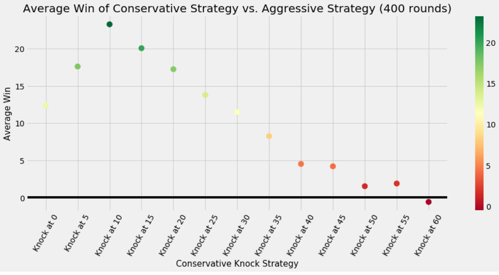

```{r, include = F}
knitr::opts_chunk$set(echo=FALSE, warning=FALSE, message = FALSE)
library(tidyverse)
library(glue)
library(plotly)
library(reactable)
library(htmltools)
results <- read_csv("../../static/data/ninecard/results.csv")
theme_clean <- function() {
  theme_bw(base_size = 11) +
    theme(text = element_text(family = "Roboto"),
          panel.grid.major.x = element_blank(),
          panel.grid.minor.x = element_blank(),
          panel.grid.minor.y = element_blank(),
          panel.background = element_rect(colour = "#E1E1E1"),
          panel.border = element_blank())
}
constant_grid_data <- results %>% 
  filter(notes %in% c("Looking for best strategy against an opponent who knocks only at 0",
                      "Completing the grid search on constant knock strategies.")) %>% 
  mutate(knocked_at = as.numeric(substr(knock_strategy, 9, nchar(knock_strategy)))) %>% 
  select(knocked_at, everything()) 


grid_search_half_triangle <- constant_grid_data %>% 
  mutate(other_player = 1 - player_number) %>% 
  filter(player_number == 1) %>% 
  left_join(constant_grid_data %>% select(sim_id, opp_knocked_at = knocked_at, opp_wins = wins, player_number),
            by = c("other_player" = "player_number", "sim_id")) %>% 
  group_by(knocked_at, opp_knocked_at) %>% 
  # This only removes some rows for when knock strategies are the same, so there are two rows which average to 0
  summarize(avg_win = weighted.mean(avg_win, rounds),
            var_win = weighted.mean(var_win, rounds),
            rounds = sum(rounds),
            wins = sum(wins),
            opp_wins = sum(opp_wins),
            elapsed_seconds = sum(elapsed_seconds)
            ) %>% 
  ungroup() 

constant_conservative_knock_grid_search <- grid_search_half_triangle %>% 
  bind_rows(
    grid_search_half_triangle %>% 
      rename(opp_knocked_at = knocked_at,
             knocked_at = opp_knocked_at,
             opp_wins = wins,
             wins = opp_wins) %>% 
      mutate(avg_win = -avg_win)
  ) %>% 
  group_by(knocked_at, opp_knocked_at) %>% 
  slice(1) %>% 
  ungroup() %>% 
  mutate(avg_win = ifelse(knocked_at == opp_knocked_at, 0, round(avg_win, 2))) %>% 
  rename(`Average Win per Round` = avg_win)
```


# Introduction  

Nine Card is a simple rummy style card game with one major complication -- any player can end the game when they feel they have the best chance to win. The game is played as a sequence of independent rounds where the goal is to minimize the value of the cards in your hand that cannot fit into "runs" (like a straight flush in poker but only requiring 3 or more cards) or "sets" (3 or 4 of a kind). Players take turns drawing and discarding until one of them "knocks," after which point all other players get one more turn before the round ends and the players reveal and compare their hands.


# Psychology and Motivation  

In a game like poker (Texas hold'em for those asking "which type of poker"), players bet on their belief that they're holding the best hand (or that they can successfully scare/bluff their opponents into this belief) by thinking about their hand as well as each of their opponents' hands. This is infinitely complex as there's no way to know in advance whether a big bet is indicative of a strong hand or a bluff. 

Nine Card is different because there are only very subtle clues available to determine the strength of your opponents' hands. Here, each player knows that (in general) the longer they play, the stronger their hand and the hands of their opponents will become. If you're dealt a good starting hand, maybe it's worth knocking right away. On the other hand, it could be worth playing a turn to dump a high value card or try to complete a set of kings (or other high value cards). This structure makes the game play more like a difficult optimization problem, and throughout this post we're going to try to solve it.


# Rules of Nine Card

Nine Card is a turn-based card game where each player is dealt nine cards at the start of the game. The remaining cards are then placed face down in the center.   

Play commences with the player to the left of the dealer. That player picks up a card, makes a decision of which cards they want to keep, and then discards one card face-up next to the deck of face-down cards. Play moves clockwise, and the next player has a choice -- they can either pick up the card that the last player just laid face-up or they can draw the top card from the face-down deck. Either way, they must then discard a card at the end of their turn. Play continues in this way until a player "knocks," signaling to the group that they are ready to end the game and reveal their hands. The remaining players have one more turn to try to make the best of their respective hands, and then the cards are revealed.  

Nine Card is played in rounds, and each round is scored. After a player knocks and the last moves are made, the players reveal their "sets" and "runs." Sets are 3 or more cards of the same number (i.e. three 4s or three 6s or four jacks) -- runs are 3 or more suited and connected cards (i.e. 3,4,5 all hearts -- J, Q, K all spades -- 2,3,4,5,6,7 all diamonds).  

The person who knocks first displays their cards -- the sets and runs are put to the side, and any remaining cards are summed (e.g. if the player has an Ace, 2 and Queen, that is 1 + 2 + 10 = 13 points). The remaining players also reveal how many points they have. The knocker compares their point total to the point total of each opponent, and then takes points from opponents with higher totals and loses points to opponents with lower totals. For example, if the person who knocked has 15 points at the end of the round, and the two opponents have 12 and 18 points respectively, the knocker will take 3 points from the opponent with 18 points and lose 3 points to the opponent with 12 points. The scores at the end of the round would then be 0 for the knocker, 3 for the player who had 12 points, and -3 for the player who had 18 points. The cards are then shuffled and dealt again -- the first player to reach 100 points wins!  

**Note:** The point values of the cards are their face value (Aces are 1 and J, Q, K are equal to 10).    

**Note:** Aces are always "low" (i.e. a run involving an Ace is always Ace, 2, 3 and never Q, K, Ace).  


# Approach 

Well, how do you start solving a problem like this? If we were pure mathematicians back at our alma mater (Go Bears!) we might try to solve this with some sort of a proof. As tempting as that sounds (note sarcasm), we decided that a game like this is so complex in terms of the number of possible outcomes and groupings of cards that the best way to learn about this problem would be to create a playable version of the game, write some strategies that vary in complexity, and let the bots take care of the rest through thousands of simulations! This turned out to be a fairly complicated task, so below we'll detail a few sections of how we did it, and then present the results and our analysis.  

## Code Structure/Architecture

We decided to take an object oriented approach to these simulations, both because it seemed like the most natural way to store and use (and reuse) information throughout the game and as a good opportunity to brush up on some programming skills that we don't use as much in our normal data analysis workflows.

Object oriented code is so natural here because unlike a standard "bring in some data, manipulate it, and then extract insights" or a "make a model" type project, Nine Card is, well, played with objects (the physical kind). If we write classes that capture the essential features of these objects, we can simply let the game play itself.

Right, so what do you need to play a game of Nine Card. As the name implies, you need... cards. The `Card` is the then the first object, and each card needs just two things -- a rank (i.e. Ace through king) and a suit (i.e. hearts, diamonds, spades or clubs). To make accounting easier later, we also keep track of a card's value. We did that using a "numeric rank;" Ace maps to 1, 2-10 map to themselves, and jack, queen, and king map to 11, 12, and 13 respectively.

Now that we have the idea of a card, we can start to get more complicated and add in various "collections of cards" that we need for the game. A game of Nine Card has a deck to deal and draw from, a hand for each player, and a face up discard pile.

Since each of these card collections are similar, we have one common `CardCollection` class, and then a `Deck`, `Hand`, and `Pile` class that inherits from `CardCollection`. Every `CardCollection` can add and remove cards (making a deck, dealing to hands, drawing, discarding) and report its own length.

The `Hand` object's only addition is that it has a score, the sum of points from cards that cannot be used in runs or sets. We used a hand scoring algorithm that we found [here.](https://www.reddit.com/r/algorithms/comments/4zfv8o/a_dynamic_programming_algorithm_for_gin_rummy/d6w04hr/)

The `Deck` object is a `CardCollection` that gets initialized as a standard 52 card deck, has the ability to get shuffled, and can remove and return its top card (aka draw from the deck).

The `Pile` is a `CardCollection` that allows you to view the top card without removing it (as all cards are face up but sacked so that only the top card is visible at any time). Just like with a deck, you can draw the top card from the discard pile.  

There isn't much use for cards to sit by themselves. We need players to actually, you know, play the game. Players are people -- they're complicated. But we'll make use of abstraction and say that players just have a name and strategies for deciding whether to draw from the deck or the discard pile, which card they'd like to discard, and when they're ready to knock and end the round. This allows them to take a complete turn. First, they decide whether or not to knock. If they knock, their turn ends. Otherwise, they decide where to draw from, look at their hand, and then decide which card to discard.  

We implemented these strategies as functions, and they all use the same basic interface. Every strategy function, no matter what kind, takes in the player's hand, the deck, the discard pile, whether any player has already knocked, and the current turn number within the round.  

The final thing we need is more of an idea then an object -- the game itself! This holds information like how many players there are, whose turn it is, the current score, when the game ends, and ultimately, who won. This `Game` object is then like a dealer. They set up the game by shuffling a deck and giving the players their hands and then use their knowledge of the rules and position of authority to keep the game moving along and keep a record of how well each player is doing after each round. In our code, a game is initialized with information about the players (names, strategies), whether the players are playing to a set score or a set number of total rounds, and then for our own sake, comments about the game, whether to use a random seed, and where to save the results.  

[You can view all of our code on our Github.](https://github.com/bmjoseph/NineCard/tree/master/scripts)  

With all this in place, we were ready to design some strategy functions so that our players can duke it out.   


# Strategies  

The very basics of the strategy boils down to 3 decisions:  

1) When should a player knock?  
2) Should a player draw from the discard pile or from the deck?  
3) What card should a player discard?  

The first question is of particular interest. In most rummy type games, you must either have all runs or all sets in your hand or played on the table, and then you can finish the game. In Nine Card however, you have the option to end the game on any turn. Therefore, you should constantly be evaluating whether ending the game on a certain turn is worth it. The basic strategy here is to try to play until you have as few points as possible, where you realistically think that it will be difficult to make progress, and then knock. We will test a strategy similar to this, but also will check what the optimal score to knock at is assuming you and your opponent will always knock at the same score.  

The second question is usually handled with a straightforward decision tree. First, look at the top card in the discard pile, if you can use it to complete a set/run then take it, otherwise, roll the dice with the rest of the deck. We will test this strategy, but also consider the option of drawing from the discard pile to get closer to a set/run (we will call these "near-sets" and "near-runs" in the rest of the post, meaning you have 2 out of the necessary 3 cards for a set or a run).

The final strategy question is what to discard. Basic strategy would suggest that you discard the highest card you have left in your hand (as long as it's not part of a set or a run). We will test this strategy but will also consider the option of holding onto cards that are part of near-sets and near-runs until later in the game.

Our strategies can be summarized as follows:
 
1) Marathoner:  
    a. Knocks: Never knock (or knock when you have a perfect score).  
    b. Draws: If you can complete a set/run by picking up a card from pile, then do so, otherwise, draw from rest of deck.  
    c. Discard: Always discard the highest card left in your hand not in a run or a set.  
	
2) Conservative:  
    a. Knocks: Always knock when you have < X points left. 
        i. X can be variable.  
    b. Draws: If you can complete a set/run by picking up a card from the pile, then do so, otherwise, draw from rest of the deck.  
    c. Discard: Always discard the highest card that is not in a set or a run.  


2) Aggressive:  
    a. Knocks: Always knock when you have < X points left.  
        i. X can be variable.  
    b. Draws: If there is still more than **half of the deck** available to draw from and if you can add a card to your deck that gets you a "near run" or a "near set" by picking up from the discard pile, then do so, otherwise, draw from the rest of the deck. If there is less than **half of the deck** available to draw from, only pick up from the discard pile if you can complete a set/run by doing so, otherwise, pick up from the rest of the deck.   
    c. Discard: If there is still more than **half of the deck** available to draw from, isolate all of the cards that are part of near runs or near sets. Then discard the highest remaining card that is not part of a set/run or a near-set/run. If there is less than **half of the deck** available to draw from, discard the highest remaining card that is not a part of a set/run.  
        i. Note, **half the deck** is a parameter that can be changed, and is later tested as a function of turns instead of cards left in the deck.  
    
Let's see how these strategies do when they play against one another!  

# Analysis + Results  

To see which strategies are the best, we ran simulations and calculated an average round score of the competing strategies. Each competition is at least 400 rounds. 

Our experiment proceeded with the following tests:  

1) Test the Marathoner against Conservative strategy.  
2) Test the Conservative strategy against itself with a grid search for best knock value.  
3) Test the Conservative strategy with the best knock value against the Aggressive strategy with the same knock value.  
4) Try to improve the strategy that lost in step 3.  
5) Test a dynamic knock strategy based on the current turn.    

## Marathoner vs Conservative Strategy:  

The difference between the marathoner and the conservative strategy is when each player knocks. Because the marathoner only knocks at a perfect score, we ran the marathoner strategy against a player that knocks between 5 and 60 points left in their hand (incremented by 5). The reason we don't go above 60 is because players don't often have more than 60 points in their hand and we deemed it too bad of an idea to knock (instead of trying to improve your hand) when you do have that many points. The results are below:

```{r}
constant_vs_0_plot <- constant_conservative_knock_grid_search %>% 
  filter(opp_knocked_at == 0) %>% 
  ggplot(aes(x = knocked_at, y = `Average Win per Round`)) +
    geom_point(size = 3, aes(color = `Average Win per Round`, text = glue("Knocked At: {knocked_at}\nOpponent: Knocks at 0\nTrials: {rounds}\nAverage Time per Round: {round(elapsed_seconds/rounds, 2)} Seconds\nAverage Win per Round: {round(`Average Win per Round`, 2)}\nRound level Variance: {round(var_win, 2)}\n"))) +
    geom_hline(yintercept = 0) +
    geom_smooth(se = F, color = "dark grey") +
    labs(title = "Conservative Strategy Grid Search Against Marathoner Opponent",
         y = "Average win Per Round",
         x = "Constant Knock Strategy (knock at x)") +
    scale_color_gradient2(high = "dark green") +
    theme_clean()

ggplotly(p = constant_vs_0_plot, tooltip = "text", width = 800)
```


Let's digest this plot. Each point represents 400 rounds of play between a player knocking at the x-axis value against a player that knocks only when they have a perfect score (i.e. pretty much never). Aside from the variance of the round level scores, we see the general trend is that when a player knocks between 10 and 25 that they win by an average of 2.5 points per round. It is also interesting to note that never knocking appears to be better than knocking too early; players that knocked when they had more than 40 points still left in their hand tended to lose by a lot. 

From this graph we learned that never knocking doesn't beat knocking when you achieve a score somewhere in the range of 10-25. But what is that score? Let's look at the next section.

## Conservative Strategy Grid  

For this section, we wanted to find out which value you should knock below when both players are playing with the conservative knock strategy. This was a time consuming operation, as the grid is 12 by 12 which makes for 72 competitions (half of the total divided by 2). Each matchup had a minimum of 400 rounds, and the values in the 10-40 range (the range where we expected the "answer" to be in) ran for 1000 rounds. The results are below -- the plotly will show data on each cell in the grid if you click the "compare data on hover" button on the top right.

```{r}
constant_conservative_knock_grid_search_plot <- constant_conservative_knock_grid_search %>% 
  ggplot(aes(x = knocked_at, y = opp_knocked_at, fill = `Average Win per Round`)) +
  geom_tile(aes(text = glue("Knocked At: {knocked_at}\nOpponent Knocks At: {opp_knocked_at}\nTrials: {rounds}\nAverage Time per Round: {round(elapsed_seconds/rounds, 2)} Seconds\nAverage Win per Round: {round(`Average Win per Round`, 2)}\nNumber of Wins: {wins}\nRound level Variance: {round(var_win, 2)}\n"))) +
  geom_text(aes(label = `Average Win per Round`), size = 3, alpha = .5) +
  scale_fill_gradient2(high = "dark green") +
  theme_clean() +
  labs(title = "Grid Search on Conservative Constant Knock Strategies",
         x = "Knock Strategy",
         y = "Opponent Knock Strategy") 
# TODO: make it compare on hover by default.
ggplotly(constant_conservative_knock_grid_search_plot, tooltip = "text", width = 800)
```


First, a comment about reading the grid. The grid above is symmetric about the y=x line and it's best to read it from the perspective of the x-axis. For example, when x = 20 and y = 0 (one player knocks at 20, the other knocks at a perfect score), the player who knocks at 20 wins by 1.97 points on an average round. When x = 0 and y = 20, the player loses by 1.97 on an average round.

With this in mind, the best strategy will be the one that has the most green on its vertical line (i.e. x = knock value). Here we can see that number is clearly 25. Knocking at 25 wins against every other value that we ran the search through, and it generally has closer matches when playing values near itself (e.g. against 20). 

Great! We've learned that knocking at 25 provides the best chances against someone that has a conservative overall strategy, regardless of what value they choose to knock at. But why is this the case? What about the number 25 is special in Nine Card? We'll continue to analyze this question, but for now, let's build some intuition. An example in the grid can help us start to unpack this question.

Look at x = 15 and y = 35. The result is a .06 average win per round for the player knocking at 15. How about x = 20 and y = 30. The result is an average loss of .07 for the player knocking at 20. These matchups are equidistant from 25 on opposite sides, and yet they draw practically even results. It is possible that 25 is the place in the game where it doesn't make sense to try to improve your hand anymore. Before 25 points, you have an opportunity and should continue to better your hand -- after reaching 25 points, knocking will bring you more points in the long run against players that choose to continue on.

While there is certainly variance on these round scores that puts us far outside the realm of statistical certainty, it becomes clear that we should consider how many turns have passed in the game. 

More on the above later, for now, let's turn to see how the aggressive strategy does against the conservative strategy.

## Aggressive vs Conservative Strategy:  

We now look to see if being a little more aggressive with what we allow into our hand and discard can help us defeat the player that doesn't take or keep any cards that don't immediately improve their hand. The aggressive strategy employs this logic until the deck (after dealing the cards) is half empty. At that point, the idea is that there aren't enough chances to improve your hand and you should start picking up and keeping only cards that immediately impact your hand. 

To test the aggressive draw and discard approaches, we held the knock values constant between the two players and ran through all knock values between 5 and 60 (incrementing by 5 as before). The results are below:



Personally, these results were very surprising. Anecdotally when I play Nine Card, I employ a strategy similar to this as I believe that picking up cards that can get me closer to a run or a set are more helpful than drawing some random card from the rest of the deck. The results indicate that this couldn't be further from the truth. Apart from when both players knock at absurdly high values (i.e. >= 50), the conservative strategy dominates the aggressive strategy. In particular, we can see that the knock value we found to be optimal in the conservative strategy (25) defeats this strategy by more than 10 points per round. 

As shocking as these results were, they helped us connect the dots on why the knock strategy at 25 is the best in the conservative strategy as well as why this aggressive strategy fails so miserably. We realized that the key ingredient we hadn't accounted for yet was what turn a particular round ended on. When playing Nine Card in real life, we found that it wasn't uncommon to get deep into the deck before somebody knocked, but we missed the idea that humans are more drawn to minimizing their score regardless of what their opponent might have -- therefore a human will play for many more turns which gives their opponent a chance to potentially "catch up," as opposed to knocking when they are ahead of the expected score curve. 

We went ahead to see how many turns it took the conservative strategy (knocking at 25) to actually knock. **The average number of turns it took to knock hovered around 8 or 9**, so that helped us explain why the aggressive strategy doesn't have a chance against the conservative strategy -- it doesn't have enough turns in the round to make their investment in near runs and sets worth it.

## Dynamic (Turn Based) Knock Strategy  

As our intuition grew for why the conservative strategy (knocking at 25) was winning against everyone, we devised a strategy that learned from this conservative strategy to defeat it. We first plotted the average score in a player's hand per turn when they employ the conservative strategy (knocking at 25). The table of values is below.  

```{r}
turn_scores <- read_csv("../../static/data/ninecard/ScoresByTurn - knock_25_strategy.csv")%>% 
  mutate(`SD Score` = case_when(`SD Score` == "-" ~ NA_real_,
                                T ~ as.numeric(`SD Score`)))
good_bad_pal <- function(x) rgb(colorRamp(c("dark green", "white",  "dark red"))(x), maxColorValue = 255)
# Render a bar chart with a label on the left
bar_chart <- function(label, width = "100%", height = "16px", fill = "#00bfc4", background = NULL) {
  bar <- div(style = list(background = fill, width = width, height = height))
  chart <- div(style = list(flexGrow = 1, marginLeft = "2px", background = background), bar)
  #label = str_pad(label, width = 7, side = "right")
  div(style = list(display = "flex", alignItems = "center"), chart)
}
turn_scores  %>% 
  mutate(count = Count) %>% 
        # avg_score = `Mean Score`) %>% 
  select(Turn, `Mean Score`, everything()) %>% 
  reactable(
    width = 800,
    defaultPageSize = nrow(turn_scores),
    defaultColDef = colDef(align = "center"),
    columns = list(
      Turn = colDef("Turn", width = 75),
      `Mean Score` = colDef("Avg Score", width = 75,
                            style = function(value) {
                              normalized <- (value - 0) / ( max(turn_scores$`Mean Score`) - 0)
                              list(background = good_bad_pal(normalized))
                              }),
      # avg_score = colDef("", width = 200,
      #                      cell = function(value) {
      #                   normalized <- (value - 0) / (max(turn_scores$`Mean Score`) - 0)
      #                   setwidth =  paste0(round(normalized*200, 2), "%")
      #                   print(setwidth)
      #                    bar <- div(style = list(background = NULL, width = setwidth, height = "16px"))
      #                     chart <- div(style = list(flexGrow = 1, marginLeft = "2px", background = good_bad_pal(normalized)), bar)
      #                     #label = str_pad(label, width = 7, side = "right")
      #                     div(style = list(display = "flex", alignItems = "center"), chart)
      #               }),
            # avg_score = colDef("", width = 200,
            #                cell = function(value) {
            #            width <- paste0(value / max(turn_scores$`Mean Score`) * 100, "%")
            #             normalized <- (value - 0) / (max(turn_scores$`Mean Score`) - 0)
            #            fill = good_bad_pal(normalized)
            #             bar_chart(value, width = width, fill = fill)
            #         }),
      `SD Score` = colDef("Score SD", width = 75,
                          cell = function(value) {
                            if (is.na(value)) {
                              "-"} else {value}}),
      `Min Score` = colDef("Min Score", width = 75,
                            style = function(value) {
                              normalized <- (value - 0) / (55 - 0)}),
      `Max Score` = colDef("Max Score", width = 75,
                            style = function(value) {
                              normalized <- (value - 0) / (100 - 0)
                              #print(normalized)
                             # list(background = good_bad_pal(normalized), color = "black")
                              }),
      `Count` =colDef(name = "", align = "right", width = 50),
     `count` =colDef(name = "Count", align = "left", width = 200,
                      cell = function(value) {
                        width <- paste0(value / max(turn_scores$Count) * 100, "%")
                        bar_chart(value, width = width)
                    }))
      
    )
```


This table of values tells a fascinating story of the score totals per round in a game of Nine Card. First, most players are being dealt ~52 points. From then on, you are expected to gain ~7 points after completing your first turn, ~5.5 points on your second turn, ~4 on your third turn, ~4 on your fourth turn, and so on. It appears that by the time you play your sixth turn, you are only expecting to gain a point every turn after that, and on average, you'll fall under 25 points on your ninth turn. 

So, we hypothesized that in order to beat the conservative strategy (knocking at 25), we would hold the conservative draw and discard aspects the same, but we would knock on any turn as long as our score was less than what we would expect our opponent to have if we allow them to take that turn. For example, we would knock right after being dealt the cards if we were dealt less than 45.20 (the expected score after one turn); we would knock on the fourth turn if we had less than 30.21 (the expected score after the fifth turn).

So, how does this strategy do? After 500 rounds of play against the (so far undefeated) conservative strategy (knocking at 25), our new dynamic strategy wins each round by an average of 1.62 points. That is a sizable difference -- most similar to the difference between two conservative players playing each other with one knocking at 25 and the other knocking between 40 and 50. 

This ultimately makes sense -- the dynamic strategy must be an improvement as it's learning when to knock from the conservative strategy (knocking at 25).

# Conclusion and Future Analyses

The strategy that we ended up picking to be the best one was the dynamic knock strategy (learned on the knocking at 25 strategy) with conservative draw and discard strategies. It is certainly possible to improve this method further -- and future iterations of this work may include more sophisticated strategies.

To recap, our key takeaways can be boiled down to:  

1) **Never knocking is a bad idea** -- a player that knocks in the 10-25 range will beat you handily. Overall,if you don't want to use a dynamic knock strategy, knock when you have <= 25 points.  
2) **It is better to be conservative with your draw and discard strategy** -- use the cards that can actually improve your hand immediately as opposed to ones that may be helpful later.  
    a. There is value in keeping only what is necessary and throwing away the highest card -- it's an easy way to lower your score and get you in a position where knocking will yield you points.  
3) **Pay attention to what turn you're on** -- You are expected to improve your hand less and less with each successive turn, and that value approaches 1 after you've reached ~25 points.
4) **Using a dynamic knock strategy is helpful** -- since there's nothing in the rules saying that you need to wait to knock till later in the game, you should knock as soon as you see that your hand is better than the expectation of your opponent's hand after they play their next turn. <u>Knocking early is fair game and should be done to maximize points!</u>

<div class="tocify-extend-page" data-unique="tocify-extend-page" style="height: 0;"></div>
